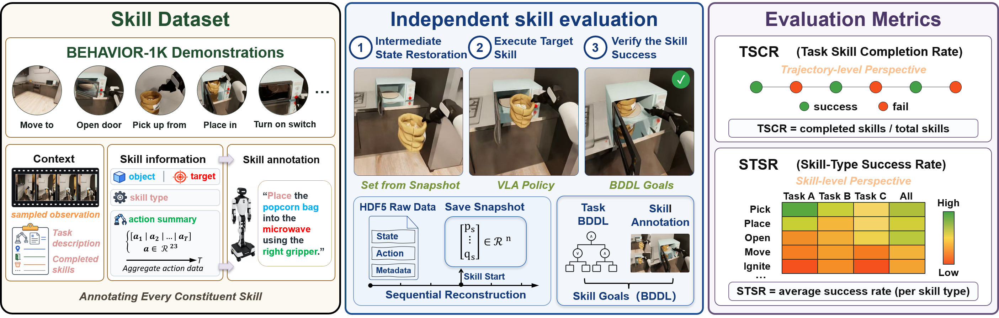
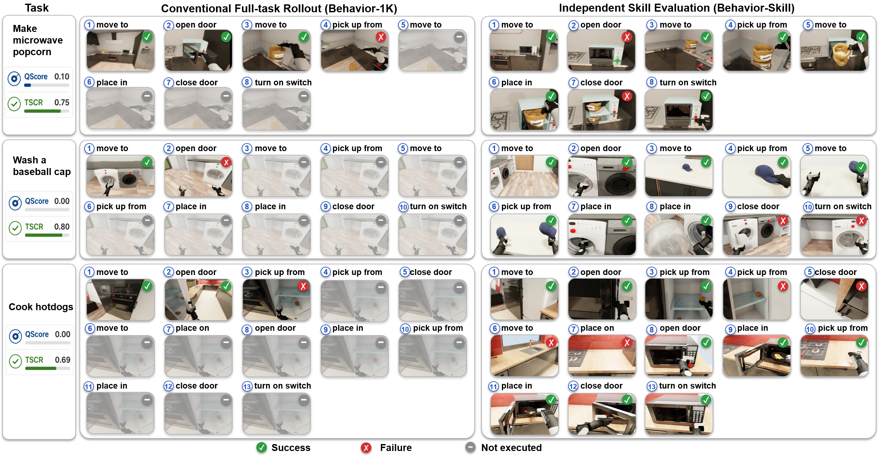
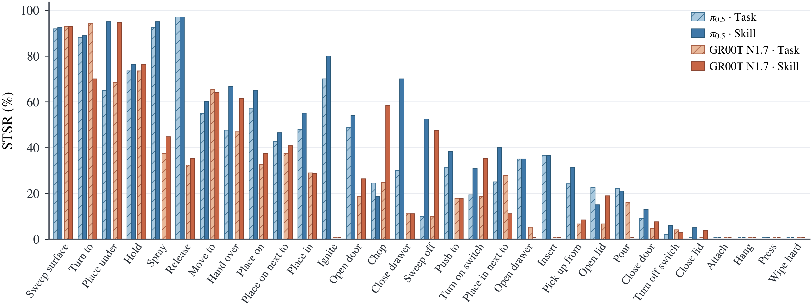

# Behavior-Skill

**A Fine-Grained Benchmark for Evaluating Vision-Language-Action Policies in Long-Horizon Tasks**

[](https://arxiv.org/abs/2608.30536)
[](https://huggingface.co/datasets/mafangniu/Behavior-Skill)
[](https://github.com/orgs/nubot-nudt/projects/3)
[](https://huggingface.co/mafangniu/Behavior-Skill-VLA-Checkpoints)
[](https://github.com/nubot-nudt/Behavior-Skill/issues/new?template=benchmark_submission.yml)

Behavior-Skill is a skill-centric dataset and evaluation benchmark built on
[BEHAVIOR-1K](https://behavior.stanford.edu/behavior-1k). It reformulates the
learning and evaluation of long-horizon tasks around executable constituent
skills. Each evaluation unit combines a skill instruction, a restorable
intermediate simulator state, an executable BDDL success condition, and an
evaluation horizon. This makes it possible to evaluate every constituent skill
independently under valid execution preconditions.

<p align="center">
  
</p>

## Highlights

- **235,492 skill instances** constructed from **10,000 demonstrations** across
  **50** long-horizon household tasks and **34** semantic skill categories.
- Skill-aligned instructions, observations, actions, object information, and
  execution context for skill-conditioned policy learning.
- Independent skill evaluation from restored intermediate states, with
  skill-specific BDDL goals and automatic success verification.
- Capability-oriented metrics, including Task Skill Completion Rate (TSCR) and
  Skill-Type Success Rate (STSR), for identifying policy bottlenecks hidden by
  aggregate task success.

## Why Independent Skill Evaluation?

Conventional full-task rollouts stop making progress after an intermediate
failure, leaving later skills unexecuted and unobserved. Behavior-Skill restores
the appropriate intermediate state for every constituent skill, allowing the
entire task capability profile to be measured.

<p align="center">
  
</p>

## Repository Scope

This repository provides the independent evaluation layer used by
Behavior-Skill:

- intermediate-state restoration and stabilization;
- skill-specific BDDL problem construction;
- closed-loop skill execution and success checking;
- local and WebSocket policy adapters;
- evaluation video and JSON result generation;
- episode-, task-, and benchmark-level metric aggregation.

The repository does **not** include the original BEHAVIOR-1K demonstrations,
the offline annotation and state-reconstruction pipeline, or model-specific
training frameworks. The released annotations, evaluation configurations, and
state snapshots are available from the
[Behavior-Skill dataset](https://huggingface.co/datasets/mafangniu/Behavior-Skill).

> [!IMPORTANT]
> Among the bundled BEHAVIOR-1K components (`bddl3/`, `joylo/`, `docs/`), only
> `OmniGibson/` is modified — mainly new evaluation predicates in
> `omnigibson/utils/bddl_utils.py` and a repository-local default dataset path —
> to support single-skill evaluation. The other directories are bundled as-is
> for convenience.

## Repository Structure

```text
Behavior-Skill/
├── setup.sh                       # One-command environment setup
├── assets/                         # Figures used in this README
├── benchmark/
│   ├── core/                       # Evaluator, BDDL construction, observations
│   ├── metrics/                    # Cross-task metric aggregation
│   ├── policies/                   # Hydra and WebSocket policy adapters
│   ├── scripts/                    # Batch evaluation launchers
│   ├── states/                     # Snapshot loading and restoration fixes
│   ├── utils/                      # Diagnostics and video recording
│   └── skill_eval.py               # Main evaluation CLI
├── data/
│   ├── skill_annotations/          # Fine-grained skill annotations
│   ├── skill_eval_configs/         # Skill instructions and BDDL goals
│   └── skill_init_states/          # State manifests and skill snapshots
├── bddl3/                          # BDDL 3.7.0 (bundled from BEHAVIOR-1K)
├── OmniGibson/                     # OmniGibson 3.7.2 fork with benchmark modifications
├── joylo/                          # JoyLo / gello utilities (bundled from BEHAVIOR-1K)
├── docs/                           # BEHAVIOR-1K documentation (bundled)
└── datasets/                       # Simulator assets, downloaded by setup.sh (created at runtime)
```

## Requirements

- Linux with an NVIDIA GPU and [conda](https://docs.conda.io);
- Python 3.10 — created automatically by `setup.sh` in the `behavior-skill`
  environment;
- the components installed by `setup.sh`: BDDL 3.7.0, the OmniGibson 3.7.2
  fork with Isaac Sim 4.5.0, and the JoyLo utilities;
- PyTorch 2.6.0, NumPy, PyYAML, Hydra, OmegaConf, and OpenCV.

Other version combinations may work, but simulator snapshots and object-state
predicates are sensitive to environment-version differences.

## Installation

### 1. Clone Behavior-Skill

```bash
git clone https://github.com/mafangniu/Behavior-Skill.git
cd Behavior-Skill
```

### 2. Run the one-command setup

From the repository root (requires `conda` on your `PATH`):

```bash
./setup.sh --new-env --omnigibson --bddl --joylo --dataset
```

This single command:

1. creates the `behavior-skill` conda environment (Python 3.10, PyTorch 2.6.0
   with CUDA 12.4 support by default);
2. installs the bundled BDDL 3.7.0, the OmniGibson 3.7.2 fork with Isaac Sim
   4.5.0, and the JoyLo utilities as editable packages;
3. downloads the simulator assets required to run OmniGibson — BEHAVIOR-1K
   assets, robot assets, and 2025 challenge task instances — into the
   repository's `datasets/` directory.

Afterwards, activate the environment:

```bash
conda activate behavior-skill
```

## Download the Benchmark Data

This step fetches the benchmark's evaluation data (annotations, evaluation
configs, and state snapshots), which is separate from the simulator assets that
`setup.sh --dataset` downloads into `datasets/`. Download the released data with
the Hugging Face CLI:

```bash
python -m pip install -U huggingface_hub
hf download mafangniu/Behavior-Skill \
  --repo-type dataset \
  --local-dir behavior_skill_data
```

Copy the released components into the repository placeholders:

```bash
cp -r behavior_skill_data/annotation-finegrain/. data/skill_annotations/
cp -r behavior_skill_data/skill_eval_configs/. data/skill_eval_configs/
cp -r behavior_skill_data/subtask_states/. data/skill_init_states/
```

The evaluation assets have the following roles:

| Component | Purpose |
|---|---|
| `skill_annotations` | Skill descriptions, categories, involved objects, temporal intervals, and action context |
| `skill_eval_configs` | Task context, skill instructions, skill categories/types, and executable BDDL goals |
| `skill_init_states` | `state_manifest.json`, `skill_N_state.npz`, and `skill_N_scene.json` files used to restore skill start states |

The paths stored in each `state_manifest.json` are resolved relative to the
repository's `data/` directory. Preserve the released directory hierarchy or
provide explicit absolute paths in the manifest.

## Model Checkpoints

The following fine-tuned pi0.5 checkpoints correspond to the paper's Task and
Skill settings:

| Checkpoint | Training tasks | Language condition |
|---|---:|---|
| [`pi05-pt50-task`](https://huggingface.co/mafangniu/pi05-pt50-task) | 50 | Complete task instruction |
| [`pi05-pt50-skill`](https://huggingface.co/mafangniu/pi05-pt50-skill) | 50 | Constituent-skill instruction |
| [`pi05-pt12-task`](https://huggingface.co/mafangniu/pi05-pt12-task) | 12 | Complete task instruction |
| [`pi05-pt12-skill`](https://huggingface.co/mafangniu/pi05-pt12-skill) | 12 | Constituent-skill instruction |

All four checkpoints are also collected in a single repository:
[mafangniu/Behavior-Skill-VLA-Checkpoints](https://huggingface.co/mafangniu/Behavior-Skill-VLA-Checkpoints).

Checkpoints are loaded by the corresponding model implementation. The
benchmark process can communicate with that implementation through a WebSocket
server, avoiding a hard dependency on one VLA codebase.

The WebSocket policy server used to serve these checkpoints during evaluation
— an adaptation of `serve_b1k.py` and related files for single-skill evaluation
— is released at
[mafangniu/pi05-behavior-skill](https://github.com/mafangniu/pi05-behavior-skill).

## Policy Integration

Behavior-Skill supports two policy backends.

### WebSocket policy

Start a model-side policy server that implements the BEHAVIOR-1K
`WebsocketClientPolicy` protocol. The benchmark sends the processed observation
dictionary and inserts the current instruction in the `prompt` field. The
server must return an action compatible with the R1Pro environment.

Connect to the server with:

```text
--websocket_host 127.0.0.1 --websocket_port 8001
```

Exactly one of `--websocket_host` and `--policy_cfg` must be supplied.

## Quick Start

The evaluation stack has three layers, each driving the next:

| Layer | Entry point | Scope |
|---|---|---|
| Python CLI | `benchmark.skill_eval` | one or more skills of one episode, single process |
| Episode launcher | `benchmark/scripts/run_all_skills.sh` | every skill of one episode, one `skill_eval` process per skill |
| Multi-GPU driver (example) | `benchmark/scripts/run_auto_eval.sh` | policy servers + episodes × runs, delegated to the episode launcher |

All commands below run inside the `behavior-skill` environment, from the
repository root (the `benchmark` package must be importable), and assume a
running policy WebSocket server — see
[Policy Integration](#policy-integration).

### Evaluate one skill

`benchmark.skill_eval` is the core Python entry point: it restores the skill's
initial state, executes the policy in closed loop, and checks the BDDL goal
(see [Evaluation Protocol](#evaluation-protocol)).

```bash
TASK=turning_on_radio
EVAL_CONFIG=/absolute/path/to/episode_config.yaml
MANIFEST=/absolute/path/to/state_manifest.json
OUTPUT=outputs/${TASK}/episode_example/run_01

python -m benchmark.skill_eval \
  --task "$TASK" \
  --eval_config "$EVAL_CONFIG" \
  --manifest "$MANIFEST" \
  --skill_id 0 \
  --websocket_host 127.0.0.1 \
  --websocket_port 8001 \
  --n_episodes 1 \
  --log_dir "$OUTPUT"
```

Key options:

- `--task` (required): task name, e.g. `turning_on_radio`;
- `--eval_config` / `--manifest`: episode evaluation YAML and state manifest.
  `--eval_config` defaults to `data/skill_eval_configs/<task>.yaml`, while the
  manifest has no usable default — pass both explicitly;
- `--skill_id`: skill IDs to evaluate (multiple values allowed); omitted, every
  skill that has both a BDDL goal and a manifest entry is evaluated in one
  simulator session;
- `--n_episodes`: how many times each skill is evaluated within this process
  (default 1; repeated-rollout statistics are normally produced by the
  `--num_runs` loop of `run_auto_eval.sh`);
- `--websocket_host` / `--websocket_port`, or `--policy_cfg` for a local
  Hydra policy — exactly one policy backend must be given;
- `--prompt` / `--prompt_file`: instruction overrides — `--prompt` replaces the
  instruction of every skill (this is how the Task setting is reproduced;
  `run_auto_eval.sh` forwards its `--task_prompt` here by default), while
  `--prompt_file` applies per-skill overrides from a JSON file
  (`{"skill_id": "prompt", ...}`);
- `--no_video`: disable video recording.

Results are written under `--log_dir` (see [Outputs](#outputs)).

### Evaluate all skills of one episode

`benchmark/scripts/run_all_skills.sh` iterates over the skills of one episode,
launching a **separate `skill_eval` process per skill** — each skill gets a
fresh simulator, so a crashed skill does not block the remaining ones. The two
positional arguments set the skill range; the special end ID `-1` reads the
maximum skill ID from the manifest:

```bash
bash benchmark/scripts/run_all_skills.sh 0 -1 \
  --task "$TASK" \
  --eval_config "$EVAL_CONFIG" \
  --manifest "$MANIFEST" \
  --host 127.0.0.1 \
  --port 8001 \
  --n_episodes 1 \
  --log_dir "$OUTPUT"
```

Options:

- `--skill_ids 0,2,5` evaluates an explicit list instead of the range;
- `--skip_existing` resumes an interrupted run by skipping skills whose
  result file (`<task>_skill_XX.json`) already exists under `--log_dir`;
- `--prompt "..."` replaces the instruction supplied to every selected skill;
- `--n_episodes` is passed through to `skill_eval` (default 1).

Per-skill results are written to `<log_dir>/<task>_skill_XX.json`, and each
skill's console output is kept in `<log_dir>/run_logs/`.

### Automated multi-GPU evaluation (example)

`benchmark/scripts/run_auto_eval.sh` is an **example** end-to-end driver. It
launches one policy WebSocket server per GPU, waits until all servers are
ready, and then runs one evaluation worker per GPU. The episodes of the
selected task are split round-robin across the workers, and each
(episode, run) combination is delegated to `run_all_skills.sh` — with
`--num_runs 10`, every episode is rolled out 10 times into the
`run_01/`…`run_10/` layout expected by the metric scripts. Once all workers
finish, the script stops the policy servers.

The embedded server launch command is the pi0.5 example: to serve the
checkpoints above for single-skill evaluation we adapted `serve_b1k.py` and
related files, released at
[mafangniu/pi05-behavior-skill](https://github.com/mafangniu/pi05-behavior-skill).
To evaluate your own policy, adapt two places in the script:

1. `POLICY_ROOT` at the top — path to your policy server repository;
2. the launch command in Step 1 — any WebSocket server exposing the policy
   API works (see [Policy Integration](#policy-integration)).

Run it with the bundled task-config JSON — `data/eval_episodes.json` maps
each task to its episodes, state root, and config root (relative paths are
resolved against the JSON's own directory):

```bash
bash benchmark/scripts/run_auto_eval.sh \
  --task_config    data/eval_episodes.json \
  --task_name      turning_on_radio \
  --policy_config  <policy_config_name> \
  --policy_dir     /path/to/checkpoint \
  --log_root       outputs \
  --num_runs       10 \
  --base_port      8001
```

…or with explicit arguments:

```bash
bash benchmark/scripts/run_auto_eval.sh \
  --task_name      turning_on_radio \
  --task_prompt    "Turn on the radio receiver that's on the table in the living room." \
  --policy_config  <policy_config_name> \
  --policy_dir     /path/to/checkpoint \
  --episodes       00400010,00400020 \
  --states_root    data/skill_init_states/task-XXXX \
  --configs_root   data/skill_eval_configs \
  --log_root       outputs \
  --num_runs       10
```

Useful options:

- `--eval_gpus N` dedicates the last `N` GPUs to evaluation while the
  remaining GPUs host the policy servers;
- `--skill_ids` and `--skip_existing` as in `run_all_skills.sh`;
- `--start_run N` starts the run counter at `N` (combine with
  `--skip_existing` to resume a partially finished sweep);
- by default the task prompt is also forwarded to the evaluator, so every
  constituent skill is evaluated under the complete task instruction (the
  Task setting); pass `--policy_prompt_only` to keep the prompt on the policy
  server side only and evaluate each skill with its own instruction from the
  evaluation YAML (the Skill setting).

Server and worker logs are written to
`<log_root>/auto_eval_logs/<task>_<timestamp>/`; per-run results land in the
`<log_root>/<task>/episode_<ep>/run_XX/` layout consumed by the metric
scripts below.

### Reproduce the Task and Skill settings

The two settings in the paper share the same states, BDDL goals, and execution
horizons. They differ only in the language condition:

- **Skill setting:** use each instruction from the evaluation YAML; no prompt
  override is required.
- **Task setting:** pass the complete task instruction through `--task_prompt`, so
  that every constituent skill is conditioned on the original task prompt.

## Evaluation Protocol

For each constituent skill, the evaluator:

1. builds a skill-specific BDDL problem from the task context and local goal;
2. restores the released scene and serialized simulator state;
3. reconstructs assisted-grasp constraints and synchronizes joint drive targets;
4. advances physics for 25 stabilization steps without issuing robot actions;
5. checks whether the goal is already satisfied at step 0;
6. executes the policy in closed loop and checks the BDDL goal after every step;
7. terminates on success or after twice the recorded demonstration duration.


## Outputs

A single run produces the following files:

```text
outputs/<task>/episode_<id>/run_01/
├── metrics/
│   └── skill_00_ep00.json
├── videos/
│   └── skill_00_ep00.mp4
├── <task>_skill_00.json
└── <task>_summary.json
```

Each per-episode metric file records the skill ID, instruction, BDDL goal,
success flag, and number of executed steps. Videos combine the head, left-wrist,
and right-wrist RGB observations.

## Metrics

### Cross-task aggregation

`cross_task_summary.py` aggregates several evaluated tasks into one
benchmark-level summary with per-skill success rates grouped by
`skill_description` and type (the STSR breakdown). It reads
`<log_root_prefix>/<task>/episode_*/episode_summary.json`, so each episode must
be summarized first — either by running `episode_summary.py` yourself, or by
passing `--regen`, which rebuilds every `episode_summary.json` from the raw
run records before aggregating (recommended after any re-evaluation):

```bash
python -m benchmark.metrics.cross_task_summary \
  --tasks task_a,task_b,task_c \
  --log_root_prefix outputs \
  --configs_root_prefix data/skill_eval_configs \
  --group_by skill_description,type \
  --regen
```

- `--tasks`: comma-separated task names (required);
- `--log_root_prefix`: parent directory of the per-task log directories;
- `--configs_root_prefix`: parent directory of the episode YAMLs, used to read
  skill metadata for the STSR groupings;
- `--group_by`: aggregation dimensions (default `skill_description,type`);
- `--regen`: rebuild each episode's `episode_summary.json` from the raw
  records first;
- `--num_runs N` (only with `--regen`): rebuild using only the first `N` runs
  of each episode; the default auto-scans the existing `run_XX` directories.

The script prints a per-skill success-rate matrix (rows = skill, columns =
tasks + overall), an overall skill ranking, and a per-task TSCR table, and
saves the full result to
`<log_root_prefix>/cross_task_skill_summary.json`.


## Benchmark Results

Overall constituent-skill completion on the complete 50-task benchmark:

| Model | Task TSCR (%) | Skill TSCR (%) | Difference |
|---|---:|---:|---:|
| pi0.5 | 42.4 | 48.4 | +6.0 |
| GR00T N1.7 | 36.9 | 42.5 | +5.6 |

<p align="center">
  
</p>


## Leaderboard and Result Submission

The current benchmark results are available on the
[Behavior-Skill Leaderboard](https://github.com/orgs/nubot-nudt/projects/3).

To submit a new result, please use the
[Benchmark Result Submission Form](https://github.com/nubot-nudt/Behavior-Skill/issues/new?template=benchmark_submission.yml).

Submissions should include:

- the method and model name;
- the prompt type (Task Prompt or Skill Prompt);
- the training data setting;
- the overall TSCR on the official evaluation set;
- task-wise TSCR and skill-type STSR results;
- the generated `cross_task_skill_summary.json`;
- paper and code links, when available.

Submitted results will be added to the public leaderboard after verification.

## Citation

If you use Behavior-Skill in your research, please cite:

```bibtex
@article{ma2026behaviorskill,
  title        = {Behavior-Skill: A Fine-Grained Benchmark for Evaluating
                  Vision-Language-Action Policies in Long-Horizon Tasks},
  author       = {Ma, Chunyun and Luo, Lun and Luo, Xingjian and Feng, Xiexing
                  and Zhang, Hang and Liu, Wei and Qiao, Feng and Wang, Yaonan
                  and Lu, Huimin and Chen, Xieyuanli},
  journal      = {arXiv preprint arXiv:2608.30536},
  year         = {2026}
}
```

## Acknowledgements

Behavior-Skill is built on
[BEHAVIOR-1K](https://behavior.stanford.edu/behavior-1k),
[OmniGibson](https://github.com/StanfordVL/OmniGibson), and
[BDDL](https://github.com/StanfordVL/bddl). We thank their contributors for
making these resources available to the robotics community.

## License

The bundled `bddl3/` and `OmniGibson/` components retain their upstream
licenses; see `bddl3/LICENSE` and `OmniGibson/LICENSE`. Add a root-level license
for the Behavior-Skill benchmark code before redistributing the complete
repository.
